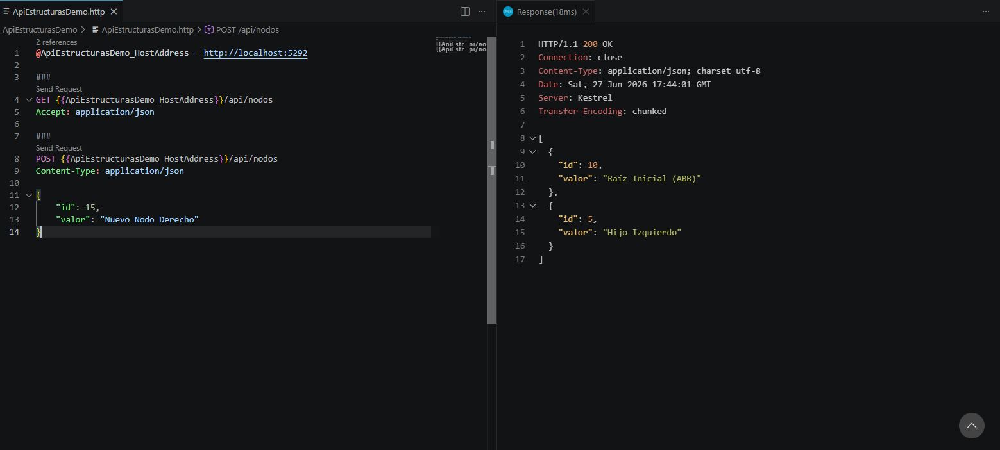
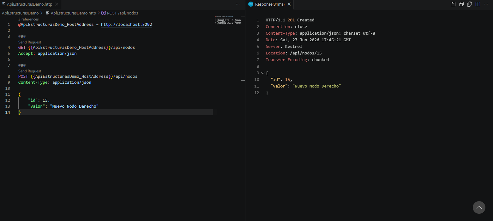

# Actividad de Investigación y Práctica
# Estructuras de Datos Avanzadas y APIs con ASP.NET Core

**Curso:** Introducción a la Programación y Computación 2

**Universidad:** Universidad de San Carlos de Guatemala

**Estudiante:** Allan Marcelo Acabal Pérez

**Carné:** 202404597

---

# Parte 1. Investigación Teórica

## 1. Estructuras de Datos Eficientes

### Árboles Binarios de Búsqueda (ABB)

Un Árbol Binario de Búsqueda (ABB) es una estructura de datos jerárquica donde cada nodo puede tener como máximo dos hijos.

Su regla principal de ordenamiento es:

- Todos los valores menores que el nodo se almacenan en el subárbol izquierdo.
- Todos los valores mayores que el nodo se almacenan en el subárbol derecho.

Esta organización permite localizar elementos de forma eficiente cuando el árbol mantiene una distribución equilibrada.

### Desventaja del ABB

Cuando los datos se insertan en un orden completamente ascendente o descendente, el árbol pierde su equilibrio y se convierte en una estructura similar a una lista enlazada.

Por ejemplo:

```

10
\
20
\
30
\
40

```

En este caso la altura del árbol aumenta considerablemente y las operaciones de búsqueda dejan de ser eficientes.

---

### Árboles AVL

Un Árbol AVL es un Árbol Binario de Búsqueda auto-balanceado.

Su objetivo es mantener una altura mínima para conservar un buen rendimiento durante las operaciones de inserción, búsqueda y eliminación.

El balance se controla mediante el **Factor de Balance**, calculado con la siguiente expresión:

**Factor = Altura Izquierda − Altura Derecha**

Interpretación del factor:

- FE = 0 → El nodo está completamente balanceado.
- FE = 1 o FE = -1 → El árbol continúa balanceado.
- FE > 1 o FE < -1 → Es necesario realizar rotaciones para restaurar el equilibrio.

Gracias a este mecanismo, la altura del árbol permanece cercana a **log₂(n)**, por lo que las operaciones principales mantienen una complejidad de:

- Búsqueda: **O(log n)**
- Inserción: **O(log n)**
- Eliminación: **O(log n)**

---

## 2. Fundamentos de Web APIs

### ¿Qué es una API?

Una API (Application Programming Interface) es un conjunto de reglas que permite que diferentes aplicaciones intercambien información de manera controlada.

En una Web API, el cliente realiza solicitudes HTTP al servidor y este responde con la información solicitada o con el resultado de una operación.

---

### Modelo Cliente-Servidor

El modelo Cliente-Servidor está formado por dos componentes principales:

**Cliente**

Es la aplicación que solicita un recurso, por ejemplo:

- Navegador web
- Aplicación móvil
- Postman
- REST Client de Visual Studio Code

**Servidor**

Recibe la solicitud, procesa la información y genera una respuesta.

El intercambio ocurre mediante el protocolo HTTP:

**Request (Petición)**

El cliente envía:

- Método HTTP
- Dirección URL
- Encabezados
- Datos (cuando corresponde)

**Response (Respuesta)**

El servidor devuelve:

- Código de estado HTTP
- Encabezados
- Información solicitada generalmente en formato JSON.

---

## Verbos HTTP

### GET

El método GET se utiliza para recuperar información sin modificar los datos almacenados.

Características:

- Recupera recursos.
- No modifica el servidor.
- Es un método idempotente, ya que múltiples solicitudes producen el mismo resultado mientras los datos no cambien.

Ejemplo:

```
GET /api/nodos
```

---

### POST

El método POST se utiliza para crear nuevos recursos dentro del servidor.

Características:

- Inserta información.
- Modifica el estado del servidor.
- No es idempotente, ya que enviar la misma solicitud varias veces puede crear múltiples registros.

Ejemplo:

```
POST /api/nodos
```

---

# Parte 2. Implementación Práctica

Se desarrolló una Web API utilizando ASP.NET Core Minimal APIs.

La aplicación implementa una colección en memoria que simula el almacenamiento de nodos pertenecientes a una estructura de datos.

## Modelo

```csharp
public class NodoElemento
{
    public int Id { get; set; }

    public string Valor { get; set; } = string.Empty;
}
```

---

## Endpoint GET

Permite recuperar todos los nodos almacenados en memoria.

```
GET /api/nodos
```

Respuesta esperada:

```json
[
  {
    "id":10,
    "valor":"Raíz Inicial (ABB)"
  },
  {
    "id":5,
    "valor":"Hijo Izquierdo"
  }
]
```

---

## Endpoint POST

Permite insertar un nuevo nodo.

```
POST /api/nodos
```

Ejemplo de petición:

```json
{
    "id":15,
    "valor":"Nuevo Nodo Derecho"
}
```

Respuesta esperada:

Código HTTP:

```
201 Created
```

---

# Parte 3. Verificación de la API

Se realizaron las pruebas utilizando el archivo **ApiEstructurasDemo.http** mediante la extensión REST Client de Visual Studio Code.

## Prueba GET

Se consultó el endpoint:

```
GET /api/nodos
```

Resultado obtenido:

- Código HTTP **200 OK**.
- Se devolvió correctamente la colección inicial de nodos.

---

## Prueba POST

Se envió la siguiente petición:

```json
{
    "id":15,
    "valor":"Nuevo Nodo Derecho"
}
```

Resultado obtenido:

- Código HTTP **201 Created**.
- El nuevo nodo fue agregado correctamente a la colección.

Posteriormente se ejecutó nuevamente el método GET para verificar que el nuevo elemento apareciera dentro de la respuesta.

---
## Evidencia - Prueba GET



---

## Evidencia - Prueba POST



# Conclusiones

- Los Árboles Binarios de Búsqueda permiten organizar información de forma jerárquica, aunque pueden perder eficiencia cuando se desbalancean.

- Los Árboles AVL solucionan este problema mediante rotaciones que mantienen el árbol balanceado y garantizan operaciones con complejidad O(log n).

- Las Web APIs permiten que diferentes aplicaciones intercambien información utilizando el protocolo HTTP.

- Los métodos GET y POST cumplen funciones diferentes: GET recupera información y POST crea nuevos recursos dentro del servidor.

- ASP.NET Core Minimal APIs facilita el desarrollo de servicios web sencillos con una implementación clara y de fácil mantenimiento.

---

# Referencias Bibliográficas

- Facultad de Ingeniería, Universidad de San Carlos de Guatemala. (2026). *Sesión 9: Árboles Binarios de Búsqueda (ABB).* Laboratorio de Introducción a la Programación y Computación 2. Guatemala.

- Facultad de Ingeniería, Universidad de San Carlos de Guatemala. (2026). *Sesión 10: Rotaciones Dobles en Árboles AVL.* Laboratorio de Introducción a la Programación y Computación 2. Guatemala.

- Microsoft. *ASP.NET Core Minimal APIs Documentation.*

- Microsoft. *HTTP APIs in ASP.NET Core.*